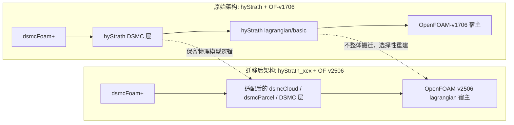
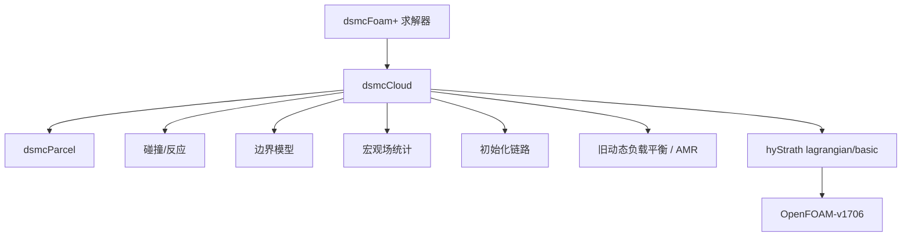
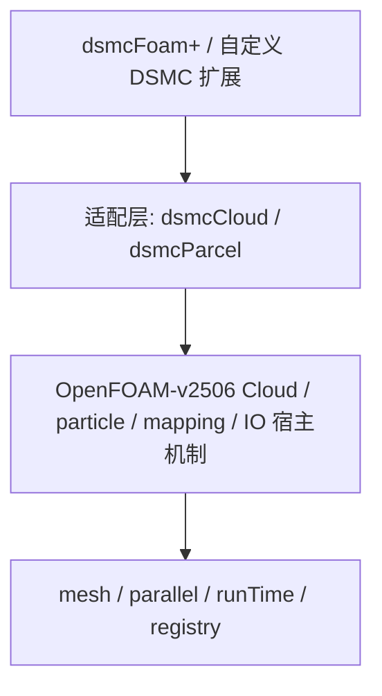
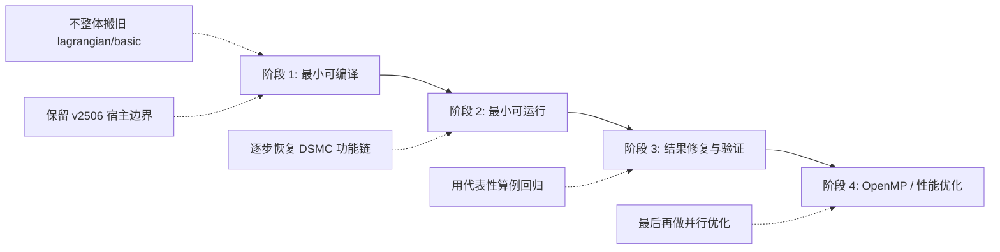
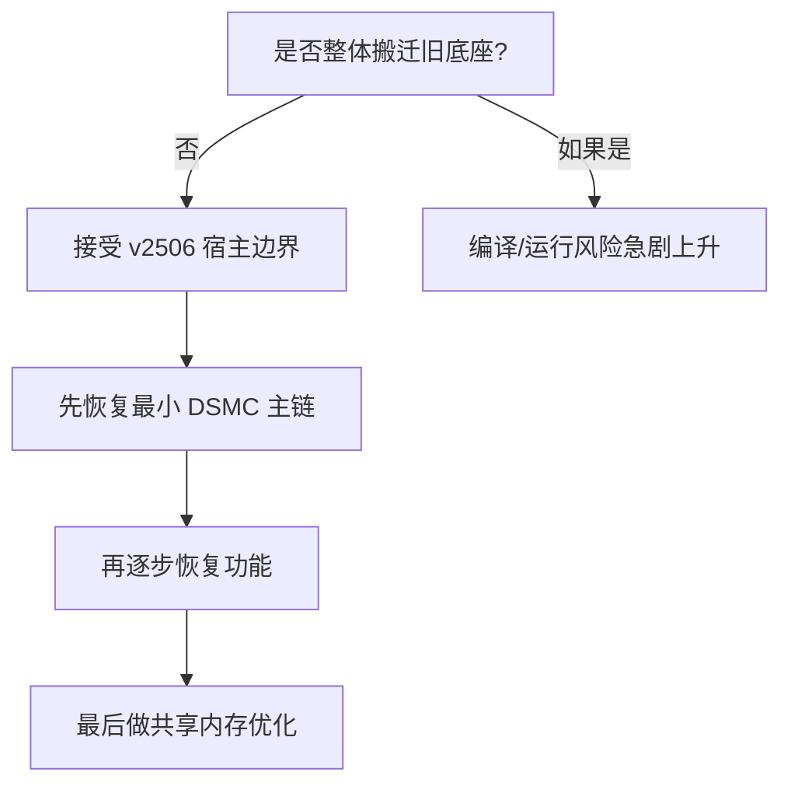
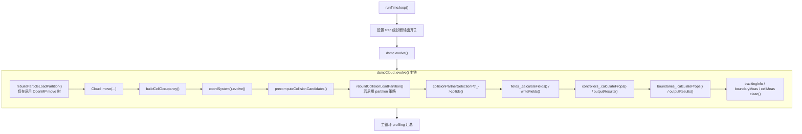

# dsmcFoam+ 从 OpenFOAM-v1706 到 OpenFOAM-v2506 的迁移过程说明

## 1. 文档目的

本文档用于记录 `dsmcFoam+` 从 `hyStrath/OpenFOAM-v1706` 迁移到
`hyStrath_xcx/OpenFOAM-v2506` 的实际过程。

文档重点包括：

- 迁移需求与范围
- `v1706` 与 `v2506` 的架构和 API 差异
- 当前项目采用的代码实现策略
- 迁移过程中的主要难点
- 验证路径与迁移后的优化方向

这是一份面向 `hyStrath_xcx` 实际工程路径的过程文档，不是泛泛的
OpenFOAM 移植教程。

## 2. 背景与需求

### 2.1 原始基线

原始代码来自：

- `hyStrath`
- 宿主平台：`OpenFOAM-v1706`
- 求解器：`dsmcFoam+`

原始 `dsmcFoam+` 并不是在上游 `dsmcFoam` 上做的少量补丁，而是带有一整套
自定义 DSMC 基础设施，主要包括：

- 自定义 `lagrangian/basic`
- 自定义 `lagrangian/dsmc`
- 自定义 `dsmcCloud`
- 自定义 `dsmcParcel`
- 扩展的碰撞、反应、初始化、边界与统计链路

### 2.2 目标基线

目标平台为：

- `OpenFOAM-v2506`
- 工作目录：`hyStrath_xcx`

### 2.3 迁移需求

本次迁移的目标并不是“一步做到全部功能完全一致”，而是分阶段实现可用基线。
实际需求为：

1. 先建立一个可用的 `v2506` 版本 DSMC 分支。
2. 先恢复最小求解器链路，再逐步恢复高级功能。
3. 第一阶段不把 `AMR` 和原始动态负载平衡耦合进来。
4. 保持与 `OpenFOAM-v2506` 运行时和构建系统兼容。
5. 尽量保留原始物理模型行为，只有在 API 变化必须适配时才修改实现。

## 3. 迁移范围与阶段划分

实际迁移是分阶段进行的。

### 3.1 第一阶段：最小可编译基线

目标：

- `liblagrangian+`
- `libdsmcFoam+`
- `dsmcFoam+`

这一阶段的要求是：

- 能通过编译
- 能执行 `dsmcFoam+ -help`
- 建立一套 `v2506` 兼容的核心骨架

这一阶段明确延后的内容包括：

- `AMR`
- 原始 MPI 负载平衡方案
- 部分高级坐标系/时间步模型
- 大量扩展边界、反应和统计模块

### 3.2 第二阶段：最小可运行链路

目标：

- `dsmcInitialise+`
- 真实初始化流程
- `dsmcFoam+` 时间推进
- 基础碰撞和宏观场链路

这一阶段的目标是让代表性非反应和反应算例真正跑起来。

### 3.3 第三阶段：正确性修复与回归验证

目标：

- 修复“能编译但结果不对”的问题
- 验证关键物理量，如 `Ma` 和 `Tvib`
- 与原始 `hyStrath` 做针对性对比

### 3.4 第四阶段：共享内存性能优化

当 `v2506` 迁移已经稳定后，在 `hyStrath_xcx` 上进一步叠加了 OpenMP
共享内存优化工作。这部分严格来说属于迁移后的优化阶段，但与迁移得到的代码结构密切相关。

## 4. v1706 与 v2506 的架构差异

本次迁移最大的难点并不在求解器主文件，而在其下方的 lagrangian 基础层。

### 4.0 架构总览示意

下面先用一张总览图说明原始架构和迁移后架构的关系。

### 4.1 原始 `v1706 + hyStrath` 架构是什么样的

原始架构可以概括为：

- 宿主平台仍然是旧版 OpenFOAM lagrangian 框架
- 但 `hyStrath` 在其上覆盖和扩展了大量 DSMC 相关基础设施
- `dsmcFoam+` 的很多能力并不是单点增量，而是依赖整套自定义云对象、粒子对象、边界、统计和反应链路

从结构上看，原始版本大致分为四层：

1. `OpenFOAM-v1706` 原生 lagrangian/basic 底座
2. `hyStrath` 自定义 `lagrangian/basic`
3. `hyStrath` 自定义 `lagrangian/dsmc`
4. 顶层 `dsmcFoam+` solver 与其算例链路

其内部关系可以进一步简化为下图：

典型特征包括：

- `Cloud` 仍以 `IDLList` 为规范粒子容器
- `particle`/`parcel` 追踪逻辑仍围绕旧版 OpenFOAM 接口展开
- 许多扩展功能直接“长”在 `dsmcCloud` 上，而不是通过更清晰的松耦合接口隔离
- 边界、反应、宏观场和初始化模块与主 cloud 之间存在较强硬依赖

#### 原始架构的优点

- 与原始 `hyStrath` 物理模型紧密耦合，功能完整
- 在 `v1706` 上经过长期累积和案例验证
- 许多模型逻辑直接嵌入主链，工程上“能跑”的路径明确

#### 原始架构的缺点

- 与 `v1706` lagrangian API 耦合过深
- 自定义 `lagrangian/basic` 侵入性大，难以直接继承到新版本
- `dsmcCloud` 职责过重，导致迁移时很难裁剪
- 许多模块默认共享同一套旧接口假设，不利于跨大版本迁移

### 4.2 `v2506` 宿主架构是什么样的

`OpenFOAM-v2506` 的 DSMC/lagrangian 体系虽然形式上仍有 `Cloud`、`particle`、
`IDLList` 等熟悉概念，但内部假设已经和 `v1706` 有明显差别。

从结构上看，新版架构的特点是：

- `Cloud` 仍是模板类，仍继承自 `IDLList<ParticleType>`
- 但围绕粒子跟踪、全局位置、映射与 IO 的细节已经按新版 OpenFOAM 方式重构
- `v2506` 更强调宿主 lagrangian 层自身的一致性，不适合再把整套旧基础层原样覆盖

迁移时能直接观察到的一些新版特征包括：

- `Cloud` 内部已经带有新版 temporary/global position 支撑
- 类型注册、模板实例化和运行时选择表的组织方式更偏新版本规范
- `autoMap()`、粒子跟踪和网格映射链路已经建立在新接口约定之上

可以把新版宿主理解为：

#### 新版架构的优点

- 宿主结构更统一，和 `v2506` 其他模块兼容性更好
- 更适合后续与新版本 OpenFOAM 生态保持一致
- 对编译、链接、运行时注册的要求更清晰

#### 新版架构的缺点

- 对旧 `hyStrath` 代码不是“平滑兼容升级”
- 老接口里的很多隐式假设在新版本中已经失效
- 一旦自定义底层改动过大，迁移成本会急剧上升

### 4.3 两套架构之间真正不同的地方是什么

迁移难点不在“类名变了”，而在“系统边界变了”。更具体地说，差异主要体现在以下几类。

#### 4.3.1 Cloud 作为主容器的角色没变，但内部语义变了

`v1706` 和 `v2506` 都还是以 `Cloud<ParticleType>` 为主容器，并且都继承自
`IDLList<ParticleType>`。这意味着表面上看，容器类型并没有被替换。

但差异在于：

- `Cloud` 内部辅助状态不同
- 映射支持不同
- 追踪时所依赖的粒子状态和全局位置机制不同
- 与网格、patch、IO 的耦合点不同

也就是说，**“壳子还是 Cloud，里面的运行规则已经不一样了”**。

这里最容易让人误解的地方是：既然 `Cloud` 名字没变、继承关系也还在，为什么不能直接继续沿用旧实现？

原因是，`Cloud` 在 OpenFOAM 里不只是“装粒子的链表”，它还承担了很多运行时语义：

- 粒子如何在网格中定位
- 粒子跨面、跨 patch、跨 processor 时如何更新状态
- 动网格或映射后，粒子如何跟着网格一起合法迁移
- 粒子位置、拓扑位置、全局位置什么时候缓存、什么时候重算
- IO 时什么被写出，读回后如何恢复成可继续跟踪的状态

换句话说，`Cloud` 不是一个单纯的数据容器，而是“容器 + 跟踪规则 + 映射规则 + IO 规则”的组合体。

在原始 `v1706 + hyStrath` 中，开发者可以默认以下事实成立：

- `Cloud` 的内部辅助状态和旧版 tracking 机制一致
- 粒子对象里保存的状态，足以让旧版跟踪器继续工作
- 原始 `hyStrath lagrangian/basic` 可以直接接管这些行为

而到了 `v2506`，虽然类名和大框架形式还在，但下面这些东西已经不一样了：

- `Cloud` 自己会维护新版 tracking/mapping 所需的临时状态
- `Cloud` 和 `particle` 之间对“当前位置是否合法”“全局位置何时有效”的约定变了
- `Cloud::autoMap()`、读写、初始化之后的恢复流程，都默认新版语义

所以“Cloud 还是 Cloud”只说明**外层抽象还在**，并不说明**内部契约没变**。

可以这样理解：

- 在 `v1706` 中，`Cloud` 更像“旧交通规则下运行的粒子容器”
- 在 `v2506` 中，`Cloud` 还是同一类车，但已经换了一套道路规则、坐标规则和过路口规则

因此迁移时真正困难的不是把类名对上，而是把 `dsmcCloud`、`dsmcParcel` 这些上层对象重新挂到新的运行规则上。

这也正是为什么本次迁移没有采用：

- 直接整体搬运旧 `lagrangian/basic`

而是采用了：

- 保留 `v2506` 宿主 `Cloud` 语义
- 在其上重建 `dsmc` 层适配

#### 4.3.2 粒子跟踪模型发生变化

旧版 `hyStrath` 的很多代码默认：

- 粒子状态表示方式是旧的
- 面穿越流程沿用旧版 `particle` 接口
- 初始化写出的粒子坐标格式可以直接给旧追踪器使用

而在 `v2506` 下，追踪模型已更偏向新版 barycentric 思路。这直接影响：

- 粒子状态表示
- face crossing
- 网格映射
- 初始化坐标写盘格式

所以迁移中会出现一种典型现象：

- 编译通过
- 初始化也能写出文件
- 但 solver 第一步就因为粒子坐标/跟踪状态不合法而崩

这里的关键术语是 **barycentric**。

### 什么是 barycentric

“barycentric” 可以译作“重心坐标”或“重心形式坐标”。

直观地说，它不是简单用一个全局笛卡尔坐标 `(x, y, z)` 来表示“粒子在哪里”，而是更强调：

- 粒子位于哪个单元/哪个局部几何区域
- 粒子在该局部几何中的相对位置是什么

也就是说，粒子的位置不再只是“世界坐标下的一个点”，而是更接近：

- “它属于哪个 cell / tet / local geometric primitive”
- “它在这个局部几何里占什么相对位置”

这种表示方式的优势在于：

- 面穿越判断更稳定
- 映射和局部跟踪更容易与网格拓扑结合
- 在复杂几何和新一代 tracking 框架下更一致

### 原始版本更接近什么方式

原始 `v1706 + hyStrath` 的很多代码习惯于用更直接的旧式思路处理粒子位置，也就是：

- 更强调粒子的物理坐标值本身
- 跟踪器按旧版接口去更新 cell、face、position 等状态
- 初始化写盘时，只要旧追踪器能识别这些坐标，就可以继续推进

在这种模式下，很多代码默认：

- “把一个位置向量写出来，读回来还是这个位置”
- “只要 cell 标号和 position 看起来没问题，就能继续追踪”

### `v2506` 为什么会带来差异

当宿主跟踪器更偏向 barycentric 思路后，粒子的“合法状态”要求变高了。
这时有效状态不仅仅是：

- 一个 `position`
- 一个 `cell`

而是：

- 这个位置与局部几何关系必须一致
- 跟踪器内部所需的局部状态必须可恢复
- 初始化、映射和跨面操作后，粒子不能只“看起来在这个 cell 里”，而必须真的满足新版 tracking 语义

这会直接带来几类差异：

#### 差异 1：初始化坐标文件不能再按旧习惯写

旧版里某些写法可能只是为了让旧追踪器读进去继续跑。
但在新版里，如果初始化写出的粒子状态不满足新版 tracking 规则，即使文件格式对、字段名也对，也可能在第一步就崩。

这就是迁移中曾经出现的现象：

- `0/lagrangian/dsmc/coordinates` 文件能生成
- 但里面有非法值
- `dsmcFoam+` 一推进就崩

#### 差异 2：face crossing 逻辑不能再照旧假设

旧版中很多针对 face crossing 的逻辑，是按旧 tracking 接口组织的。
在 `v2506` 下，即使数学意义上“粒子越过了一个面”，更新过程也必须按新版规则维护局部几何状态。

否则会出现：

- cell 变了，但局部状态没变
- position 对了，但 tracking 状态不对
- 短步长时勉强过，长程运行后累计出错

#### 差异 3：autoMap / 动网格 / AMR 更敏感

旧版里某些映射后修正，可能只要把位置和 cell 改一改就够了。
但新版 tracking 对局部一致性更敏感，因此：

- `autoMap()` 的调用顺序
- 全局位置缓存
- 映射前后粒子状态恢复

都比旧版更严格。

这正是为什么本次迁移把：

- `AMR`
- 旧动态负载平衡
- 高风险 autoMap 链路

放到了后续阶段，而不是第一阶段一起解决。

### 这对迁移意味着什么

对于 `dsmcFoam+` 从 `v1706` 到 `v2506` 的迁移，这部分的实际含义是：

1. 不能只把 `particle`/`parcel` 的字段名改对就认为迁移完成。
2. 不能只看编译通过，还必须看初始化后的第一步推进是否稳定。
3. 不能简单沿用旧版初始化写盘和跟踪假设。
4. 与 tracking 紧耦合的模块，必须建立在 `v2506` 宿主规则之上重新适配。

所以“barycentric 带来的差异”本质上不是一个数学名词问题，而是：

> 新版宿主对“什么样的粒子状态才是合法可追踪的”定义已经变了。

而迁移工作的核心，就是把原始 `hyStrath` 的 DSMC 逻辑重新挂到这套新定义之上。

#### 4.3.3 映射与动网格相关接口不再兼容

旧版 `hyStrath` 关于：

- `autoMap()`
- mesh mapping
- AMR 后粒子状态维护

的实现，建立在旧宿主流程上。

而 `v2506` 对这些接口的调用时机和前置要求已经改变，例如：

- `Cloud::autoMap()` 依赖新版的全局位置缓存/映射流程

所以这类模块不能在第一阶段直接保留，只能先剥离。

#### 4.3.4 类型注册、模板实例化和链接收敛方式不同

旧版很多“能在旧环境里碰巧通过”的写法，在新版本里会直接暴露出：

- `TypeName`/debug 定义缺失
- 模板实例化不完整
- 求解器和库的链接顺序不正确

这类问题本身不复杂，但数量多，而且会阻断整个库链的收敛。

### 4.4 这些差异对应的迁移难点是什么

从工程角度，可以把迁移难点归纳成 4 类。

#### 4.4.1 旧 `lagrangian/basic` 不能整体平移

这是最关键的一点。

如果强行把旧 `hyStrath lagrangian/basic` 全量移到 `v2506`，会遇到：

- 编译层 API 不兼容
- 运行层语义不兼容
- 后续和 `v2506` 宿主继续分叉越来越大

这意味着迁移不可能靠“整目录替换”完成。

#### 4.4.2 `dsmcCloud` 硬依赖过多

原始 `dsmcCloud` 不只是一个云对象，还承担了：

- 反应入口
- 碰撞统计
- 宏观场接口
- 初始化联动
- 高级边界/测量支持

这导致它在迁移中成为“最大耦合点”。任何底层变化都会沿着它向上传播。

#### 4.4.3 运行时正确性问题不容易在编译期暴露

例如：

- `Ma` 被错误写成全零
- `Tvib` 结果粗糙或阈值行为异常
- 初始化坐标写盘不适配新版 tracking

这些问题不是 build error，而是只有在真实算例下才会暴露。

#### 4.4.4 并行与 profiling 路径容易出现隐藏 bug

迁移完成后继续做 OpenMP/MPI 工作时，才又暴露出：

- reduce 口径问题
- profiling 总结逻辑错误
- MPI 最终汇总死锁

这说明迁移并不是“把 solver 跑起来”就结束，还要把诊断与并行链路一起修正。

### 4.5 针对这些难点，实际采用了什么解决思路

迁移中的核心方法不是“补更多兼容宏”，而是“重新划边界”。

整体迁移路线可概括为：

#### 4.5.1 不移植整套旧底座，而是接受新版宿主边界

这是一条根本策略：

- 保留 `v2506` 宿主 lagrangian 基本边界
- 在其上重建 `dsmcFoam+` 所需 DSMC 层
- 不把旧 `lagrangian/basic` 整体当成必须原样继承的资产

这一步直接降低了迁移复杂度。

#### 4.5.2 先做“最小 cloud/parcel 链路”

具体做法是：

- 先让 `dsmcCloud`
- `dsmcParcel`
- `dsmcFoam+`
- `dsmcInitialise+`

形成最小可编译、最小可运行链路。

而不是一开始就追求：

- 全部反应模型
- 全部边界
- 全部测量
- AMR
- 动态负载平衡

#### 4.5.3 把高风险模块延后

最典型的延后对象是：

- `AMR`
- 旧动态负载平衡
- 高级映射链路

因为这些模块最依赖旧宿主 API，而且不是“先让求解器跑起来”所必需的。

#### 4.5.4 先恢复功能，再修结果，再做性能

迁移实际顺序是：

1. 先编译
2. 再运行
3. 再修 `Ma/Tvib` 等结果问题
4. 最后才做 OpenMP 性能优化

这个顺序是必要的，因为如果基础结果都不对，后面的性能优化没有意义。

### 4.6 原始架构与新版架构的优缺点对比总结

#### 原始 `v1706 + hyStrath` 架构

优点：

- 功能完整
- 历史算例基础好
- 物理模型深度集成

缺点：

- 与旧 API 绑定太深
- 迁移成本高
- 模块边界不够清晰
- 不利于继续向新版本 OpenFOAM 演化

#### 新版 `v2506` 宿主架构

优点：

- 更贴近当前 OpenFOAM 主线
- 构建和运行时规范更统一
- 有利于后续继续适配新版本

缺点：

- 对旧代码不友好
- 旧假设会大面积失效
- 很多历史功能必须重挂接，而不是直接拷贝

### 4.7 为什么当前的解决方法是合理的

从结果上看，当前 `hyStrath_xcx` 的迁移路线证明了这套方法是合理的：

- 没有试图一次性保留整套旧底座
- 先建立可编译、可运行、可验证的 `v2506` 版本
- 再逐步恢复物理链路
- 最后再做共享内存优化

这条路线的代价是：

- 迁移周期更长
- 需要分阶段验证

但换来的好处是：

- 风险可控
- 每一步都能回归
- 代码最终仍然立足于 `v2506` 宿主框架，而不是停留在“旧版代码勉强能编”的状态

最后可以把这套思路总结成一张“迁移决策图”：

### 4.8 迁移后 `hyStrath_xcx` 的运行时主循环结构

迁移完成并逐步恢复功能后，`hyStrath_xcx` 的运行时主循环可以概括为如下结构：

这张图对应了迁移后以及后续 OpenMP 优化阶段的主线结构。它反映了几个关键事实：

- `move / buildCellOccupancy / collision / post fields` 已经被显式拆开分析与 profiling；
- `collision` 在运行时已经可以在 `dynamic / guided / partition` 等策略间切换；
- `move` 和 `collision` 的负载处理已经与传统串行版本不同；
- `post fields/output` 仍然是独立模块，并不是简单附属在碰撞之后的少量尾部逻辑。

## 5. hyStrath_xcx 的迁移策略

本次迁移最关键的决策是：

> 不强行把整套 `v1706` lagrangian/basic` 直接塞进 `v2506`

而是采用以下策略：

- 保留 `v2506` 的宿主 lagrangian 假设
- 在其上重新适配 DSMC 层
- 将 `hyStrath` 特有逻辑逐步恢复

### 5.1 新建工作树

建立独立工作目录：

- `hyStrath_xcx`

这样可以避免直接破坏原始 `hyStrath` 源码树。

### 5.2 保宿主，适配求解器

迁移过程中没有试图整体移植旧的底层容器，而是重点适配：

- `dsmcCloud`
- `dsmcParcel`
- 求解器入口
- 运行时类型注册
- 构建系统

### 5.3 早期先削减硬依赖

原始 `dsmcCloud` 以及相关模块对很多第二阶段功能存在硬依赖，因此早期迁移必须：

- 先瘦身 `dsmcCloud`
- 增加必要的兼容处理
- 暂时隔离不影响最小运行链路的扩展功能

### 5.4 先重建，再恢复

实际工作流是：

1. 先让库编译通过
2. 再让求解器链接通过
3. 再打通初始化
4. 再让简单算例推进
5. 最后再恢复功能并修运行时回归

## 6. 主要涉及的代码区域

### 6.1 求解器与云对象主链

- `src/lagrangian/dsmc/clouds/dsmcCloud.H`
- `src/lagrangian/dsmc/clouds/dsmcCloud.C`
- `applications/solvers/discreteMethods/dsmc/dsmcFoam+/dsmcFoam+.C`

### 6.2 Parcel 层

- `src/lagrangian/dsmc/parcels/dsmcParcel.H`
- `src/lagrangian/dsmc/parcels/dsmcParcel.C`
- `src/lagrangian/dsmc/parcels/dsmcParcelIO.C`

### 6.3 构建与类型注册

- `src/lagrangian/basic/Make/*`
- `src/lagrangian/dsmc/Make/*`
- `src/lagrangian/dsmc/dsmcTypes.C`

### 6.4 初始化与碰撞链路

- `applications/utilities/preProcessing/dsmc/dsmcInitialise+/dsmcInitialise+.C`
- 各类碰撞模型
- 各类碰撞对选择模型

### 6.5 宏观场与派生统计量

- `src/lagrangian/dsmc/macroscopicProperties/.../dsmcVolFields.C`

## 7. 主要技术难点

### 7.1 编译通过不代表运行正确

第一轮编译成功之后，运行时仍然暴露出大量问题，主要集中在：

- 初始化
- 粒子跟踪
- 宏观场输出
- 并行归约路径

所以迁移并不是纯 API 适配，后续还需要系统性的运行时修复。

### 7.2 `Ma` 场错误

迁移后曾出现一个明确回归：

- `Ma` 全场变成 0

根因：

- 保护条件用了 `molecularMass > SMALL`
- 分子质量本身远小于 `SMALL`
- 导致 `Ma` 计算分支整体被跳过

修复方式：

- 将相关判断改成 `VSMALL`

这属于迁移过程中引入的实现错误。

### 7.3 `Tvib` 问题分析

`Tvib` 的实现需要分别对照：

- 原始 `hyStrath`
- `SPARTA`
- Bird 2013 中的定义

分析结果表明：

- 多模态聚合里有一个问题本身就存在于旧 `hyStrath`
- 当前单模态 `N2` 算例里的低激发区粗糙，主要是统计与阈值行为造成，不是 `v2506` 迁移本身引入的

### 7.4 反应初始化与运行链路恢复

反应算例暴露出更多脆弱点，包括：

- 初始化链路
- 反应配置读取
- 宏观场与属性读取
- 长程运行下的稳定性

这些都是在反应算例回归中逐步修复的。

### 7.5 并行归约与 profiling 正确性

在后续 OpenMP/MPI 优化中，又出现了额外工程问题：

- 某些 `Field` 级 reduce 写法不再适合新版本
- profiling 需要改成只统计主循环 wall time
- MPI 最终 profiling 输出一度存在归约死锁，后续通过让所有 rank 参与最终 reduce 修复

## 8. 验证路径

### 8.1 编译级验证

验证对象包括：

- `liblagrangian+`
- `libdsmcFoam+`
- `dsmcFoam+`
- `dsmcInitialise+`

### 8.2 最小运行链路验证

通过代表性算例确认：

- 初始化可运行
- 求解器能推进
- 串行、MPI、OpenMP 运行路径都可用

### 8.3 场量级验证

重点验证：

- `Ma` 不再错误为零
- `Tvib` 行为与旧版和参考定义一致或可解释

### 8.4 反应算例验证

用反应 cylinder 算例对比：

- 串行
- MPI
- OpenMP

比较指标包括：

- 总 wall time
- 主循环各阶段 profiling
- 粒子数变化
- 碰撞统计
- 反应相关趋势

## 9. 迁移后的共享内存优化

当 `v2506` 迁移稳定后，`hyStrath_xcx` 又继续叠加了参考论文和
`ParDSMC3D` 的 OpenMP 共享内存优化。

### 9.1 已吸收的思路

- 将 `Move/Index` 与 `Collision` 分开看待
- 增加 OpenMP 运行时开关
- 引入线程私有 RNG
- 增加主循环 profiling
- 引入内部共享批次视图

### 9.2 尚未完全达到的状态

当前实现还没有完全等价于 `ParDSMC3D`，原因在于：

- 规范粒子容器仍然没有改成原生按 cell 连续存储
- `partition` 并不总是优于 `dynamic`
- 论文里依赖的强数据局部性条件，在当前 `hyStrath_xcx` 中还不完全具备

### 9.3 实际效果

尽管如此，当前 `hyStrath_xcx` 已经实现了：

- 稳定的 OpenMP 路径
- 反应算例上的明显加速
- 在某些长程反应算例里，OpenMP 优于 MPI，因为 MPI 的 collision 负载不均衡会越来越严重

### 9.4 `schedule_sweep_300step_20260404` profiling 结果

为比较迁移后 `OpenMP move` 与 `collision` 调度策略的实际效果，针对
`hyStrath_xcx/case/cylinder_react/schedule_sweep_300step_20260404`
进行了 `300 step` 的 sweep。对比对象包括：

- `omp8` 下 `move = dynamic/guided/static`
- `omp8` 下 `collision = dynamic/guided/partition/static`
- `mpi8` 作为参考基线

本节统一以日志最后一次 `ClockTime` 作为总 wall time 指标，以 `Evolve profiling summary`
作为主循环分项指标。

#### 9.4.1 总体对比表

| 排名 | 组合 | 最终 ClockTime [s] | Evolve total [s] | 相对最佳慢 [%] |
| --- | --- | ---: | ---: | ---: |
| 1 | `omp8_move_static_coll_dynamic` | 266 | 273.28 | 0.0 |
| 2 | `omp8_move_guided_coll_dynamic` | 269 | 278.24 | 1.1 |
| 3 | `omp8_move_dynamic_coll_dynamic` | 278 | 290.17 | 4.5 |
| 4 | `omp8_move_dynamic_coll_partition` | 279 | 291.30 | 4.9 |
| 5 | `omp8_move_guided_coll_partition` | 280 | 292.86 | 5.3 |
| 6 | `omp8_move_static_coll_partition` | 284 | 296.66 | 6.8 |
| 7 | `omp8_move_static_coll_guided` | 287 | 300.11 | 7.9 |
| 8 | `omp8_move_dynamic_coll_guided` | 291 | 300.67 | 9.4 |
| 9 | `omp8_move_guided_coll_guided` | 291 | 301.20 | 9.4 |
| 10 | `omp8_move_static_coll_static` | 292 | 305.68 | 9.8 |
| 11 | `omp8_move_dynamic_coll_static` | 294 | 304.87 | 10.5 |
| 12 | `omp8_move_guided_coll_static` | 298 | 309.82 | 12.0 |
| 13 | `mpi8` | 418 | 450.30 | 57.1 |

从总时间看，最佳组合为 `move_static + coll_dynamic`。在本次 sweep 中：

- 最佳 `omp8` 相比 `mpi8`，wall time 降低约 `36%`
- 最差 `omp8` 组合仍明显快于 `mpi8`
- `omp8` 组合内部的差异主要由 `collision schedule` 决定，而不是 `move schedule`

#### 9.4.2 最佳、最差与 MPI 参考的主循环分项

| 组合 | move only [s] | buildCellOccupancy [s] | collision phase [s] | reaction/output [s] | post fields/output [s] | total profiled [s] |
| --- | ---: | ---: | ---: | ---: | ---: | ---: |
| `omp8_move_static_coll_dynamic` | 133.86 | 45.49 | 58.28 | 4.23 | 31.42 | 273.28 |
| `omp8_move_guided_coll_static` | 135.85 | 47.27 | 89.79 | 4.49 | 32.41 | 309.82 |
| `mpi8` | 171.58 | 13.41 | 235.34 | 1.43 | 28.54 | 450.30 |

该表反映出：

- `omp8` 内部最佳与最差组合的主要差异集中在 `collision phase`
- `move only`、`buildCellOccupancy`、`post fields/output` 在不同 `omp8` 组合间波动较小
- `mpi8` 的主要瓶颈也是 `collision phase`，其耗时远高于 `omp8`

#### 9.4.3 按 `collision schedule` 汇总

| collision schedule | 平均 ClockTime [s] | 平均 collision phase [s] | 平均 Evolve total [s] |
| --- | ---: | ---: | ---: |
| `dynamic` | 271.0 | 59.0 | 280.6 |
| `partition` | 281.0 | 72.2 | 293.6 |
| `guided` | 289.7 | 84.5 | 300.7 |
| `static` | 294.7 | 89.4 | 306.8 |

这说明在当前 `cylinder_react` 反应算例上：

- `collision = dynamic` 明显最好
- `partition` 是次优方案，但仍显著落后于 `dynamic`
- `guided/static` 在碰撞阶段都明显更差

换言之，本轮 sweep 的首要控制参数不是 `move` 侧 OpenMP 调度，而是
`collision` 阶段的调度策略。

#### 9.4.4 按 `move schedule` 汇总

| move schedule | 平均 ClockTime [s] | 平均 collision phase [s] | 平均 Evolve total [s] |
| --- | ---: | ---: | ---: |
| `static` | 282.2 | 76.2 | 293.9 |
| `guided` | 284.5 | 76.0 | 295.5 |
| `dynamic` | 285.5 | 76.6 | 296.8 |

与 `collision` 相比，`move` 的影响明显更弱：

- `move_static` 略优于 `move_guided`
- `move_dynamic` 略差，但差距不大
- 说明当前粒子推进阶段的负载不均尚不足以抵消 `dynamic` 带来的调度开销

#### 9.4.5 结论与当前默认建议

基于这组 `300 step` profiling，可得到以下工程结论：

- 当前最优默认组合应为 `move = static`，`collision = dynamic`
- 若考虑次优且相对稳健的方案，可保留 `move = guided`，`collision = dynamic`
- 当前 `partition` 尚不能稳定超过 `dynamic`
- `collision phase` 是当前 OpenMP 优化的第一主战场，`move` 调度优化属于次级微调
- 对于该反应算例，`mpi8` 的主要性能短板并不在 `buildCellOccupancy`，而在 `collision phase`

因此，迁移后的共享内存优化已经不是“是否启用 OpenMP”的问题，而是进一步进入了
“OpenMP 下不同阶段如何分别选取最合适调度策略”的细化优化阶段。

## 10. 经验总结

### 10.1 迁移的是整套求解链，不只是主文件

对于 `dsmcFoam+` 这种代码，迁移不能只看 solver 主程序，真正的工作量主要在：

- cloud 基础设施
- parcel 行为
- 初始化
- 类型注册
- 宏观场统计
- 运行时控制路径

### 10.2 应尽量利用新宿主架构

强行把旧版 lagrangian/basic` 全量塞进 `v2506`，成本和风险都更高；
相反，在 `v2506` 宿主假设上重建 DSMC 层，更符合工程可行性。

### 10.3 必须明确分阶段推进

将工作拆成：

- 最小可编译
- 最小可运行
- 正确性修复
- 性能优化

是本次迁移能够持续推进的关键。

### 10.4 性能优化必须放在正确性之后

OpenMP 优化确实带来了很大收益，但它只有在 `v2506` 版本已经正确、稳定的前提下才有意义。

## 11. 当前状态

当前的 `hyStrath_xcx` 可以概括为：

- 已经成功把 `dsmcFoam+` 从 `OpenFOAM-v1706` 迁移到 `OpenFOAM-v2506`
- 串行、MPI、OpenMP 路径都已可用
- 主要运行时回归问题已修复
- 在此基础上，继续叠加了共享内存优化

与 `ParDSMC3D` 相比，当前最大的结构差距仍然是数据布局：

- `hyStrath_xcx` 已经引入了共享批次视图
- 但规范粒子存储仍然受 OpenFOAM 风格 cloud 容器限制

这也是为什么某些论文式 `partition` 调度策略当前还不能在所有场景下稳定优于 `dynamic`。

## 12. 后续建议文档

建议这份过程文档后续配套以下文档：

1. 当前 `hyStrath_xcx` 的 build/run 指南
2. 非反应与反应回归验证报告
3. `hyStrath_xcx` 的 OpenMP/load-decoupling 设计说明
4. 基于 `git diff --name-only` 的文件级迁移附录
